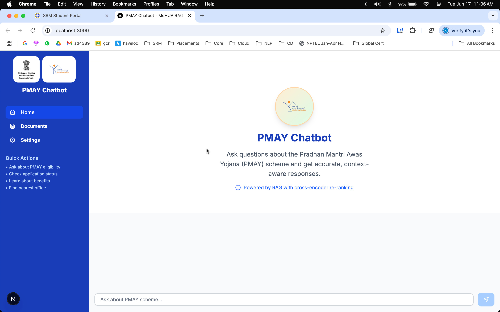
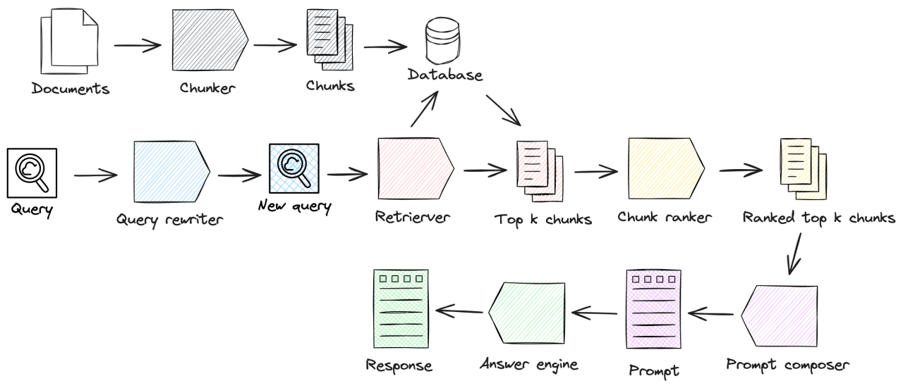

# 🤖 PMAY Chatbot - MoHUA RAG-based Assistant

A  Retrieval-Augmented Generation (RAG) chatbot for the Ministry of Housing and Urban Affairs (MoHUA), designed to answer queries about the Pradhan Mantri Awas Yojana (PMAY) scheme. Built with a modern FastAPI backend, Next.js frontend, and local LLM inference via Ollama.

---

## 📸 Screenshots

<!-- Replace these with your own screenshots -->
<div align="center">
  
  <p><em>Main chat interface of the PMAY Chatbot</em></p>
</div>

<div align="center">
  
  <p><em>Document upload and processing interface</em></p>
</div>

<!-- Add more screenshots as needed -->

---

## 🔄 System Architecture

<div align="center">
  
  <p><em>High-level architecture of the PMAY Chatbot system</em></p>
</div>

---

## 🌟 Features

- **Intelligent Document Processing**: Upload and process PDF documents containing PMAY-related information. Extracts text and metadata for semantic search.
- **Advanced RAG Implementation**: Uses ChromaDB for vector storage and retrieval, with local embeddings via Ollama.
- **Cross-Encoder Re-ranking**: Reranks retrieved documents using a local cross-encoder model for improved answer relevance.
- **Text-to-Speech (TTS)**: Converts answers to speech in English and Hindi using local models.
- **Multi-language Support**: English and Hindi interface and answers.
- **Modern UI**: Responsive, accessible chat interface with document upload, model/language selection, and source viewing.
- **API Endpoints**: RESTful endpoints for chat, document upload, feedback, health, cache, and TTS.
- **Self-Consistency Prompting**: Generates multiple candidate LLM responses and selects the most consistent answer for robustness.
- **Cached Responses using Redis**: Fast, cached responses for repeated or common queries using Redis.
- **Robust Fallback Mechanism**: Graceful fallback answers when no relevant information is found.
- **Source Attribution**: Every answer includes links to the source documents.
---

## 🚨 Prerequisites

- **Node.js** 18+
- **Python** 3.8+
- **Ollama** (for local LLM inference) — [https://ollama.com/](https://ollama.com/)
- **ChromaDB** (installed via Python requirements)
- **Redis** (for caching, optional but recommended)

---

## 🔧 Local Setup Instructions

### Backend Setup

1. **Set up Python virtual environment**
   ```sh
   cd backend
   python -m venv .venv
   source .venv/bin/activate  # On Windows: .venv\Scripts\activate
   ```

2. **Install Python dependencies**
   ```sh
   pip install -r requirements.txt
   pip install -e .
   ```

3. **Set up environment variables**
   Create a `.env` file in the backend directory (if needed for local config):
   ```
   # Example (edit as needed)
   OLLAMA_BASE_URL=http://localhost:11434
   CHROMA_DB_PATH=./demo-rag-chroma
   REDIS_URL=redis://localhost:6379/0
   ```

4. **Start Ollama**
   - Download and install Ollama from [https://ollama.com/](https://ollama.com/)
   - Pull the required models (e.g., Llama 3, Nomic Embed):
     ```sh
     ollama pull llama3
     ollama pull nomic-embed-text
     ```
   - Start the Ollama server:
     ```sh
     ollama serve
     ```

5. **Run the backend server**
   ```sh
   uvicorn api.main:app --reload
   ```

### Frontend Setup

1. **Install Node.js dependencies**
   ```sh
   cd frontend
   npm install
   ```

2. **Set up environment variables**
   Create a `.env.local` file in the frontend directory:
   ```
   NEXT_PUBLIC_API_URL=http://localhost:8000
   ```

3. **Run the frontend server**
   ```sh
   npm run dev
   ```

4. **Open [http://localhost:3000](http://localhost:3000)** in your browser to use the application.

---

## 📚 Project Structure

```
pmay-chatbot/
├── backend/
│   ├── api/            # FastAPI application (REST endpoints)
│   ├── core/           # Core business logic (LLM, vector store, caching, etc.)
│   ├── models/         # Model files (cross-encoder, TTS, etc.)
│   ├── utils/          # Utility functions
│   ├── docs/           # Documentation files
│   └── requirements.txt
├── frontend/
│   ├── app/           # Next.js pages and API routes
│   ├── components/    # React components (chat, upload, TTS, etc.)
│   ├── hooks/         # Custom React hooks
│   ├── lib/           # Utility functions
│   └── public/        # Static assets
└── models/            # Shared model definitions
```

---

## 🛠️ Technical Stack

### Backend
- **Framework**: FastAPI
- **Vector Database**: ChromaDB (local)
- **Embeddings**: Ollama (nomic-embed-text)
- **LLM**: Ollama (Llama 3, Sarvam, etc.)
- **Text Processing**: LangChain, PyPDF2, Unstructured
- **Re-ranking**: Cross-encoder (ms-marco-MiniLM-L-6-v2, local)
- **Caching**: Redis (optional)
- **TTS**: Local models (English, Hindi)

### Frontend
- **Framework**: Next.js 14
- **Styling**: Tailwind CSS
- **UI Components**: shadcn/ui
- **State Management**: React Hooks
- **API Client**: Axios

---

## 🔍 API Reference (Key Endpoints)

- `POST /chat` — Chat with the bot (streaming responses, source attribution)
- `POST /upload` — Upload a PDF document for ingestion
- `GET /upload` — List uploaded documents
- `POST /feedback` — Submit feedback on a response
- `GET /cache/stats` — View greeting cache statistics
- `DELETE /cache/clear` — Clear the greeting cache
- `GET /health` — System health check
- `POST /tts/english` — Text-to-speech (English)
- `POST /tts/hindi` — Text-to-speech (Hindi)
- `GET/POST /config/self-consistency` — Get or update self-consistency prompting config

---

## 🧪 Testing

- **Backend**: Run the test suite for enhanced chatbot features:
  ```sh
  cd backend
  python test_enhanced_chatbot.py
  ```
- **Covers**: Greeting cache, fallback, RAG, cache management, health check, and more.

---

## ⚠️ Troubleshooting

- **Ollama not running**: Ensure `ollama serve` is active and required models are pulled.
- **ChromaDB/SQLite errors**: Check file permissions and database path.
- **Redis not available**: The app will run, but caching will be limited.
- **PDF upload issues**: Only text-based PDFs are supported (no scanned images).
- **Frontend/backend connection**: Verify `NEXT_PUBLIC_API_URL` and backend server port.

---

## 🤝 Contributing

1. Fork the repository
2. Create a feature branch
3. Commit your changes
4. Push to the branch
5. Create a Pull Request

---

## 📝 License

This project is licensed under the MIT License. See the LICENSE file for details.

---

## 🔗 Useful Links

- [Ollama Documentation](https://ollama.com/)
- [ChromaDB Documentation](https://docs.trychroma.com/)
- [Next.js Documentation](https://nextjs.org/docs)
- [FastAPI Documentation](https://fastapi.tiangolo.com/)
- [PMAY Official Website](https://pmay-urban.gov.in/)
- [MoHUA Official Website](https://mohua.gov.in/)
